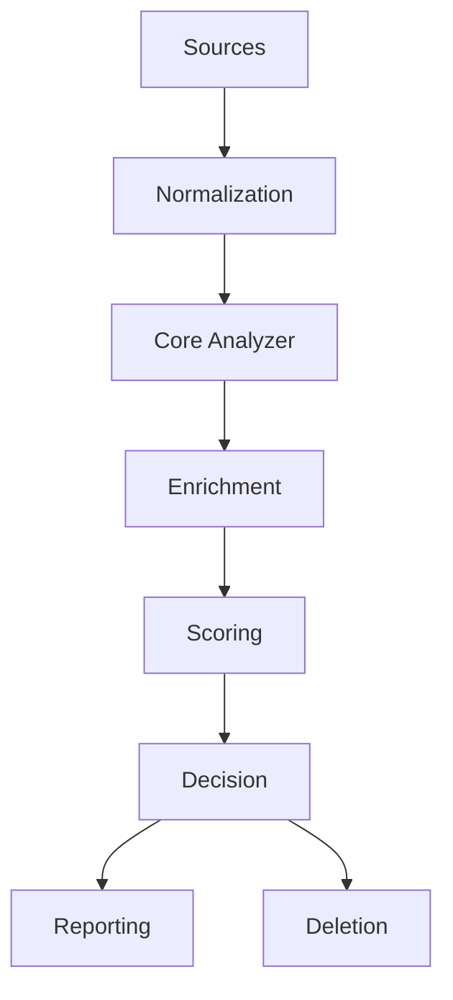
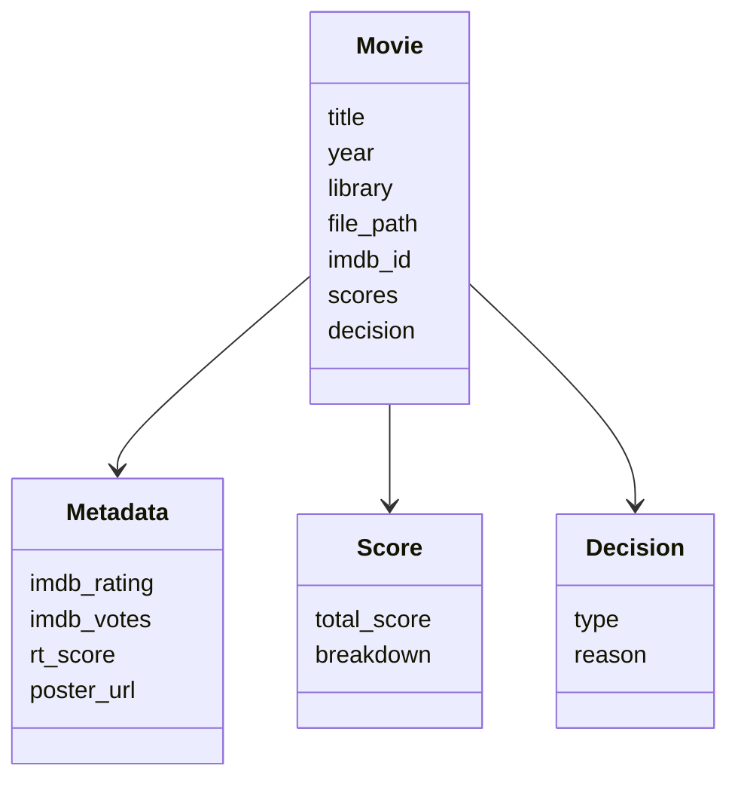

# Architecture – Analiza Movies (Technical) 🏗️

Este documento es la **referencia técnica exhaustiva** del proyecto Analiza Movies.
Describe arquitectura, módulos, flujos de datos, decisiones de diseño y límites explícitos.

---

## 1. Objetivo técnico

Construir un sistema **determinista y explicable** que:
- Analice bibliotecas de películas
- Enriquezca datos desde múltiples fuentes
- Produzca decisiones reproducibles
- Mantenga el borrado completamente desacoplado

---

## 2. Principios de diseño

- Separación estricta de responsabilidades
- No efectos secundarios durante el análisis
- No dependencia de bases de datos
- Cache explícita y auditable
- UI desacoplada del core

---

## 3. Arquitectura por capas

### 3.1 Input Layer
Responsable de adquirir películas desde fuentes externas.

**Módulos**
- analiza_plex.py
- plex_client.py
- analiza_dlna.py
- dlna_discovery.py
- movie_input.py
- analyze_input_core.py

**Responsabilidades**
- Descubrimiento
- Extracción mínima
- Normalización inicial

---

### 3.2 Core Domain

**Módulos**
- movie_analyzer.py
- metadata.py
- metadata_fix.py
- data_utils.py

**Responsabilidades**
- Modelo interno Movie
- Correcciones heurísticas
- Consistencia de datos

---

### 3.3 Enrichment Layer

**Módulos**
- omdb_client.py
- wiki_client.py

**Características**
- Cache JSON persistente
- Fallbacks
- Errores aislados

---

### 3.4 Scoring & Decision

**Módulos**
- scoring.py
- decision_logic.py
- candidates.py

**Características**
- Scoring determinista
- Umbrales explícitos
- Razones trazables

---

### 3.5 Reporting & UI

**Módulos**
- reporting.py
- report_loader.py
- summary.py
- stats.py
- charts.py
- components.py
- dashboard.py

---

### 3.6 Deletion Layer

**Módulos**
- delete_logic.py
- delete.py

**Reglas**
- Nunca invocado automáticamente
- Usa resultados persistidos
- Confirmación explícita

---

## 4. Diagrama de arquitectura

---

## 5. Modelo de dominio

---

## 6. Flujo de ejecución

1. Input discovery
2. Normalización
3. Enriquecimiento
4. Correcciones
5. Scoring
6. Decisión
7. Persistencia
8. Acción manual

---

## 7. Configuración

- config.py centraliza defaults
- .env solo para secretos
- Sin configuración dinámica runtime

---

## 8. Logging

- logger.py
- Niveles configurables
- Sin dependencia UI

---

## 9. Límites explícitos

- No series
- No escritura en Plex
- No borrado automático
- No BD

---

## 10. Deuda técnica

- Cache ilimitada
- Scoring hardcodeado

---

## 11. Extensiones previstas

- YAML config
- Plugin system
- Versionado
- Tests

---

**Este documento es la fuente de verdad técnica del proyecto.**
