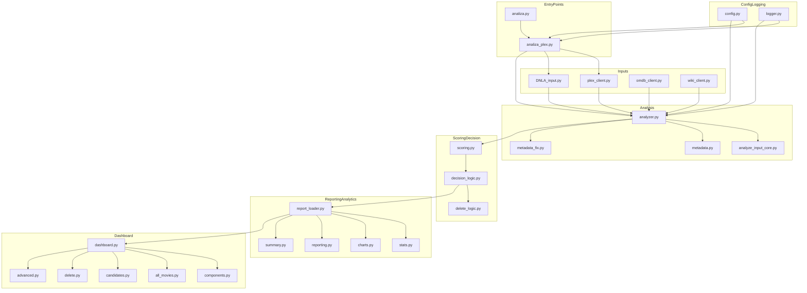

# Analiza Movies — Architecture Overview

This document describes the internal architecture of **Analiza Movies**, outlining module responsibilities, data flows, and interactions between components.  
The goal is to provide a clear, high‑level understanding of how the system works and how each part fits together.

---

## 1. High‑Level Architecture

Analiza Movies follows a **modular, pipeline‑oriented architecture**:

1. **Input Layer**  
   - Retrieves raw data from Plex or DLNA sources.
   - Optional external enrichment (OMDb, Wikipedia).

2. **Processing & Normalization Layer**  
   - Transforms raw inputs into structured movie analysis rows.
   - Detects metadata issues and applies normalization logic.

3. **Scoring & Decision Layer**  
   - Applies heuristics and Bayesian‑style scoring.  
   - Classifies movies (KEEP, DELETE, UNKNOWN, MISIDENTIFIED).

4. **Reporting & Output Layer**  
   - Generates CSV reports.  
   - Calculates aggregate statistics.  
   - Builds visual charts for the dashboard.

5. **Presentation Layer (Dashboard)**  
   - Streamlit UI for browsing, filtering, and deciding.  
   - Supports deletion workflows with safety rules.

6. **Execution / Orchestration Layer**  
   - Entrypoints coordinate the pipeline and enforce config & logging.

---

## 2. Module Responsibilities

### 2.1 Input & External Services

| Module | Purpose |
|-------|---------|
| `plex_client.py` | Connects to Plex, retrieves libraries/movies, handles deletion operations. |
| `omdb_client.py` | Queries OMDb, extracts ratings, applies retry logic, stores JSON cache. |
| `wiki_client.py` | Fetches and caches Wikipedia data. |
| `DNLA_input.py` | Abstracts DLNA‑style inputs when Plex is not used. |

---

## 3. Processing & Normalization Pipeline

### 3.1 Raw Input → Normalized Row

Key modules:

- **`analyze_input_core.py` / `analyzer.py`**  
  Central transformation pipeline:
  - Normalizes titles, years, IDs.
  - Validates fields.
  - Extracts relevant OMDb/Wiki attributes.
  - Combines Plex and external metadata.

- **`metadata.py`**  
  Detects:
  - Wrong years  
  - Duplicate / conflicting entries  
  - Very low metadata completeness  

- **`metadata_fix.py`**  
  Generates actionable recommendations:
  - Suggested title
  - Corrected year
  - Missing fields to repair

---

## 4. Scoring & Decision Logic

### 4.1 Scoring

`scoring.py` computes:

- Bayesian IMDb rating  
- Combined vote‑adjusted quality score  
- Rotten Tomatoes contributions  
- Age relevance (penalization rules)  
- Plex user rating weighting  

### 4.2 Decision Classification

`decision_logic.py` assigns categories:

- **KEEP**  
- **DELETE**  
- **UNKNOWN** (insufficient or contradictory data)  
- **MISIDENTIFIED** (metadata issue detected)

Rules depend on thresholds from `config.py`.

### 4.3 Safe Deletion Rules

`delete_logic.py` implements:

- Multi‑step confirmation  
- Prevention of accidental mass deletions  
- Logging of all deletion actions  

---

## 5. Reporting & Analytics

### 5.1 CSV Report Generation

`report_loader.py` loads the final consolidated report:

```
report_all.csv → pandas DataFrame
```

Ensures correct types and schema validation.

### 5.2 Metrics & Statistics

`stats.py` computes:

- Rating distributions  
- Decade histograms  
- Votes and popularity metrics  
- Size / duration summaries  

### 5.3 Charting

`charts.py` uses **Altair** to build:

- Bar charts  
- Histograms  
- Trend analyses  
- Quality distributions  

---

## 6. Streamlit Dashboard Architecture

Dashboard modules:

| Module | Description |
|--------|-------------|
| `dashboard.py` | Main Streamlit app controller. |
| `components.py` | Reusable UI pieces (movie cards, filters, selectors). |
| `all_movies.py` | Full movie library view. |
| `candidates.py` | Focused list of deletion candidates. |
| `delete.py` | Controlled deletion workflow. |
| `advanced.py` | Power‑user tools (filters, debugging, metadata inspection). |

Dashboard consumes the analysis CSV + caches, allowing fast startup without re‑querying Plex or OMDb.

---

## 7. Execution & Configuration

### 7.1 Entrypoints

- **`analiza.py`**  
  Main executable: asks user whether to analyse Plex or DLNA and launches the right workflow.

- **`analiza_plex.py`**  
  Full analysis pipeline controller:
  - Connect to Plex  
  - Iterate libraries  
  - Run movie analysis pipeline  
  - Write final report & summary  

### 7.2 Configuration System

`config.py` centralizes:

- API keys (Plex, OMDb)  
- Decision thresholds  
- Retries, caching rules  
- Exclusion lists  
- Silent mode flags  

### 7.3 Logging

`logger.py` ensures:

- Consistent formatting  
- Optional silent mode  
- Traceability for deletions and pipeline steps  

---

## 8. Data Flow Diagram (Simplified)

```
           ┌──────────────┐
           │   Plex API   │
           └──────┬───────┘
                  │ Movies
                  ▼
        ┌─────────────────────┐
        │  analyzer pipeline  │
        └──────┬──────────────┘
               │ Normalized Row
               ▼
      ┌────────────────────┐
      │   Scoring Engine   │
      └────────┬───────────┘
               │ Score + Flags
               ▼
     ┌──────────────────────┐
     │ Decision Logic        │
     └────────┬─────────────┘
              │ Category
              ▼
     ┌───────────────────────┐
     │ report_all.csv         │
     └────────┬──────────────┘
              │ Load
              ▼
     ┌────────────────────────┐
     │   Streamlit Dashboard   │
     └────────────────────────┘
```

---

## 9. Caching Strategy

| Cache | Source | Purpose |
|-------|---------|---------|
| `omdb_cache.json` | OMDb | Stores rating responses to avoid repeated API usage. |
| `wiki_cache.json` | Wikipedia | Stores extracted summaries and metadata. |

Caches ensure fast re-runs without regenerating external queries.

---

## 10. Safety & Defensive Design

- All external calls wrapped in retry logic.  
- All deletion actions logged and double‑confirmed.  
- Parsing pipeline uses defensive validation to avoid crashes on malformed data.  
- Dashboard never deletes anything without explicit confirmation.  

---

## 11. Extensibility Points

The system is designed for future expansions:

- Adding new metadata providers  
- Supporting additional media servers  
- Enhanced scoring heuristics  
- Automated metadata correction  
- Machine‑learning quality predictors  

---

If you want a **diagram in SVG**, a **UML class diagram**, or a **data-contract schema**, I can generate those too.


---

## 12. UML-Style Module Diagram (Mermaid)

The following Mermaid diagram shows the main modules and their relationships at a high level.



---

## 13. SVG Architecture Diagram (Simplified)

Below is a simple SVG block diagram capturing the main layers of the system.  
You can open this in any browser or vector editor to tweak it as needed.

```svg
<svg xmlns="http://www.w3.org/2000/svg" width="920" height="520">
  <style>
    .box { fill: #f5f5f5; stroke: #333; stroke-width: 1.2; }
    .title { font-family: Arial, sans-serif; font-size: 14px; font-weight: bold; }
    .text { font-family: Arial, sans-serif; font-size: 12px; }
  </style>

  <!-- Inputs -->
  <rect x="20" y="40" width="260" height="120" class="box"/>
  <text x="30" y="60" class="title">Inputs</text>
  <text x="30" y="80" class="text">plex_client.py</text>
  <text x="30" y="100" class="text">DNLA_input.py</text>
  <text x="30" y="120" class="text">omdb_client.py</text>
  <text x="30" y="140" class="text">wiki_client.py</text>

  <!-- Analysis -->
  <rect x="320" y="40" width="260" height="120" class="box"/>
  <text x="330" y="60" class="title">Analysis &amp; Normalization</text>
  <text x="330" y="80" class="text">analyzer.py</text>
  <text x="330" y="100" class="text">analyze_input_core.py</text>
  <text x="330" y="120" class="text">metadata.py</text>
  <text x="330" y="140" class="text">metadata_fix.py</text>

  <!-- Scoring / Decision -->
  <rect x="620" y="40" width="260" height="120" class="box"/>
  <text x="630" y="60" class="title">Scoring &amp; Decision</text>
  <text x="630" y="80" class="text">scoring.py</text>
  <text x="630" y="100" class="text">decision_logic.py</text>
  <text x="630" y="120" class="text">delete_logic.py</text>

  <!-- Reporting -->
  <rect x="120" y="220" width="260" height="120" class="box"/>
  <text x="130" y="240" class="title">Reporting &amp; Analytics</text>
  <text x="130" y="260" class="text">report_loader.py</text>
  <text x="130" y="280" class="text">stats.py</text>
  <text x="130" y="300" class="text">charts.py</text>
  <text x="130" y="320" class="text">reporting.py, summary.py</text>

  <!-- Dashboard -->
  <rect x="440" y="220" width="260" height="120" class="box"/>
  <text x="450" y="240" class="title">Streamlit Dashboard</text>
  <text x="450" y="260" class="text">dashboard.py</text>
  <text x="450" y="280" class="text">components.py</text>
  <text x="450" y="300" class="text">all_movies.py, candidates.py</text>
  <text x="450" y="320" class="text">delete.py, advanced.py</text>

  <!-- Config / Logging -->
  <rect x="20" y="380" width="260" height="100" class="box"/>
  <text x="30" y="400" class="title">Config &amp; Logging</text>
  <text x="30" y="420" class="text">config.py</text>
  <text x="30" y="440" class="text">logger.py</text>

  <!-- Entrypoints -->
  <rect x="320" y="380" width="260" height="100" class="box"/>
  <text x="330" y="400" class="title">Entrypoints</text>
  <text x="330" y="420" class="text">analiza.py</text>
  <text x="330" y="440" class="text">analiza_plex.py</text>

  <!-- Arrows -->
  <defs>
    <marker id="arrow" markerWidth="8" markerHeight="8" refX="4" refY="4" orient="auto" markerUnits="strokeWidth">
      <path d="M0,0 L8,4 L0,8 z" fill="#333" />
    </marker>
  </defs>

  <line x1="280" y1="100" x2="320" y2="100" stroke="#333" stroke-width="1.2" marker-end="url(#arrow)" />
  <line x1="580" y1="100" x2="620" y2="100" stroke="#333" stroke-width="1.2" marker-end="url(#arrow)" />
  <line x1="450" y1="160" x2="250" y2="220" stroke="#333" stroke-width="1.2" marker-end="url(#arrow)" />
  <line x1="450" y1="160" x2="570" y2="220" stroke="#333" stroke-width="1.2" marker-end="url(#arrow)" />
  <line x1="450" y1="340" x2="450" y2="380" stroke="#333" stroke-width="1.2" marker-end="url(#arrow)" />
</svg>
```

---

## 14. Developer-Oriented Notes

- The core contracts between layers are **pandas DataFrames** with stable column sets (e.g. the normalized movie report).  
- External service clients (`omdb_client.py`, `wiki_client.py`, `plex_client.py`) are designed to be thin and **side-effect free** except for network I/O and cache updates.  
- Most business rules live in `scoring.py`, `decision_logic.py` and `metadata*.py`; this is where new heuristics or rules should be introduced.  
- The Streamlit dashboard only **reads** from the report and interacts with the deletion logic through well-defined functions, avoiding direct low-level access to Plex.  
- Type hints are expected to be strict enough for mypy/Pyright; new code should follow the same practice.
